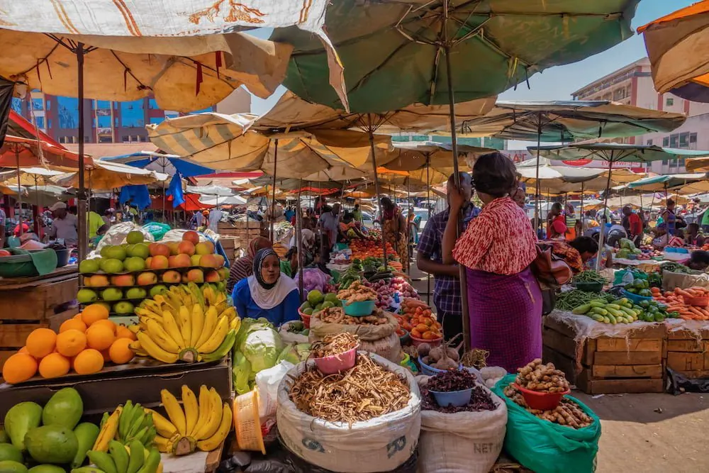
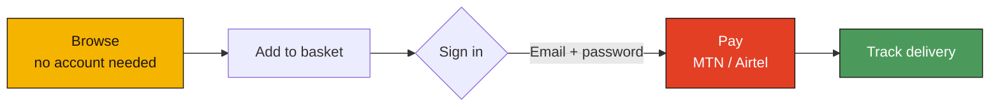
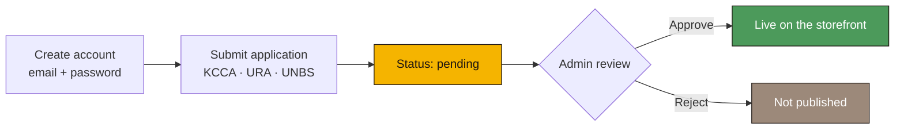
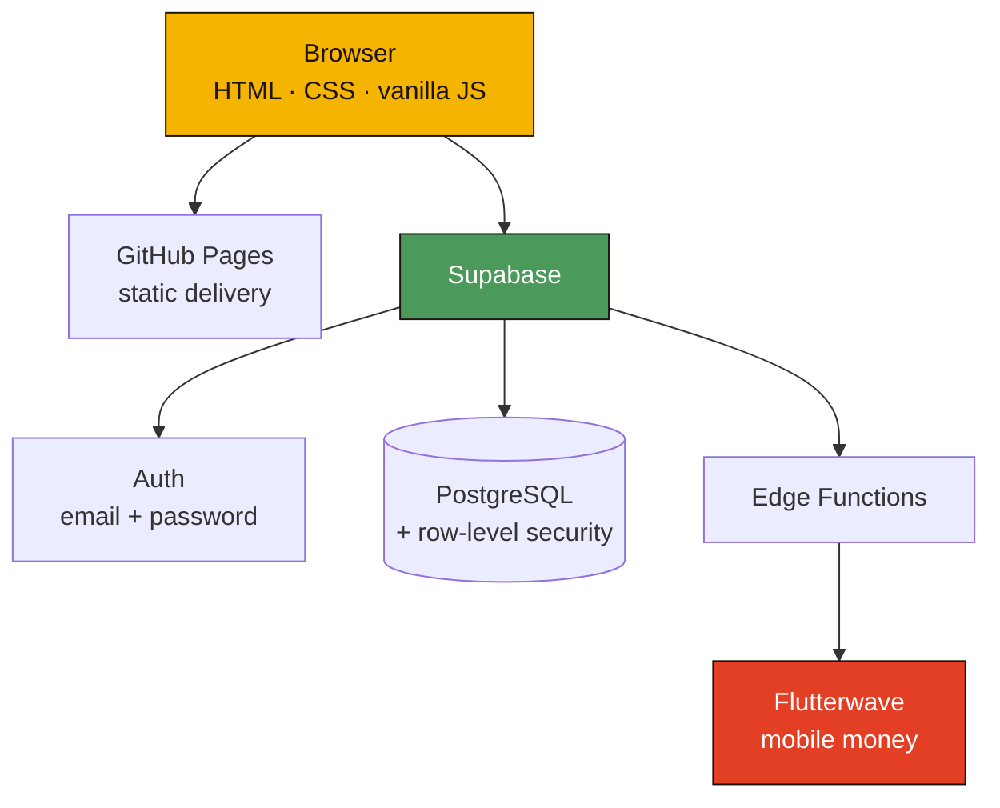
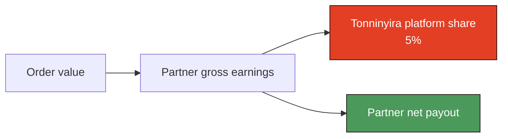

### Discover locally. Order simply. Work transparently.

A local-first marketplace for Kampala's neighbourhood stalls. Browse without an account,
pay with MTN or Airtel mobile money, and have it delivered by a verified rider.

  
  
  
  
  

<a href="https://speakpower-commits.github.io/tonninyira/index.html"><strong>Open the live marketplace →</strong></a>

 

The businesses Tonninyira brings online — open-air produce traders in Kampala.

---

## What is Tonninyira?

People should be able to find a good local stall without signing up first. The platform should
only ask for an account when real money or private customer data is involved.

That gives one straight path: **browse → choose → basket → sign in → pay → track**. Discovery is
public; everything transactional sits behind a verified account.

Every account — customer, vendor, rider — is created with an **email address and a password**. The
phone number is optional at sign-up and collected where it is actually needed: at checkout for a
customer, on the application for a vendor or rider, because that is the number a rider calls. Nobody
waits for an SMS to get in.

| Area | What you find there |
| --- | --- |
| **Eats** | Meals, snacks and ready-to-eat food from local stalls and food businesses. |
| **Shop** | Groceries, raw foods, second-hand goods and everyday household items. |

---

## How ordering works

---

## How a stall joins

Every vendor creates an account, submits an application with their trading credentials, and
waits for review. Nothing reaches the storefront unapproved.

> [!IMPORTANT]
> **The gate is enforced in the database, not the interface.** A row-level security policy lets
> an applicant create only their own record, and only in a `pending` state — so a vendor cannot
> approve themselves even by calling the API directly. `vendors_public` serves approved rows
> only, so an unreviewed stall is invisible to shoppers.

---

## Architecture

| Layer | Choice | Why |
| --- | --- | --- |
| Frontend | Vanilla JS | No framework weight — it has to stay fast on an ordinary Android phone and a thin connection. |
| Backend | Supabase | Auth, PostgreSQL, row-level security and serverless functions in one platform. |
| Hosting | GitHub Pages | Static delivery straight from the repository, no build step. |
| Payments | Flutterwave | MTN and Airtel mobile money, the way Uganda actually pays. |

---

## Marketplace economics

Partners are shown what they earned, what Tonninyira took, and what they are owed — as three
separate figures, never one net number.

---

## Project status

Built and deployed; not yet exercised end to end. Stated plainly so nobody tests against the
wrong expectation.

| Area | State |
| --- | --- |
| Storefront and public browsing | ✅ Live |
| Accounts, email sign-up and password sign-in | ✅ Live |
| Vendor / rider sign-up and approval queue | ✅ Live |
| Admin command centre | ✅ Live |
| Mobile-money payments | ⏳ Built, not yet tested end to end |
| Rider dispatch and delivery tracking | ⏳ Built, not yet tested end to end |

---

## Roadmap

**Near term**
- End-to-end mobile-money verification against the Flutterwave sandbox
- Vendor and rider notification centre
- Customer order tracking through each fulfilment stage

**Next**
- Map-based location selection and road-aware delivery routing
- Partner performance dashboards
- Repeat-purchase recommendations

**Longer term**
- Demand heatmaps and delivery-zone planning from real order geography
- Unit-economics modelling per stall, per neighbourhood

---

## Documentation

- **[docs/ARCHITECTURE.md](docs/ARCHITECTURE.md)** — data model, authentication and
  authorization, wishlist design, analytics event model, security notes, repository layout
  and local development.
- **[Live site](https://speakpower-commits.github.io/tonninyira/index.html)** — the running marketplace.

---

**Built for local commerce. Designed to scale with evidence.**

Tonninyira · Kampala, Uganda

