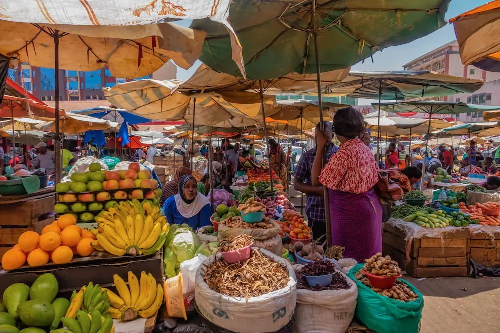
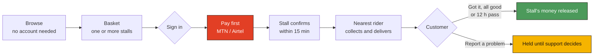
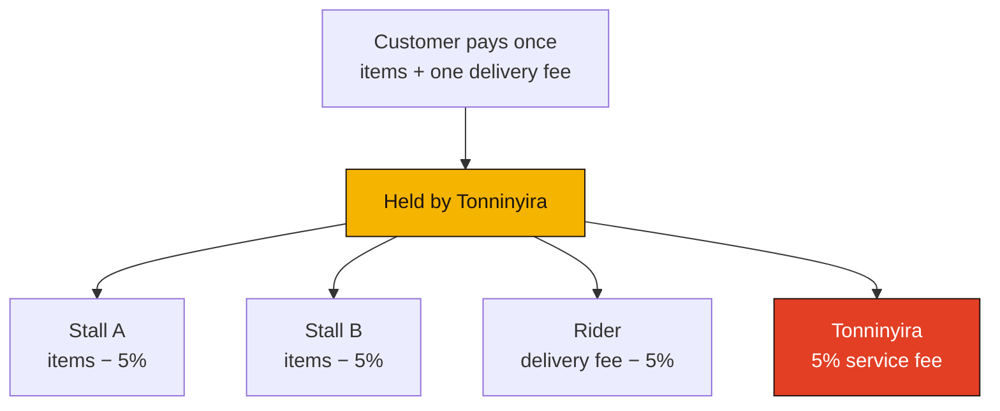
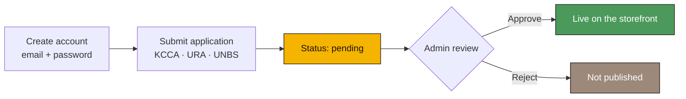
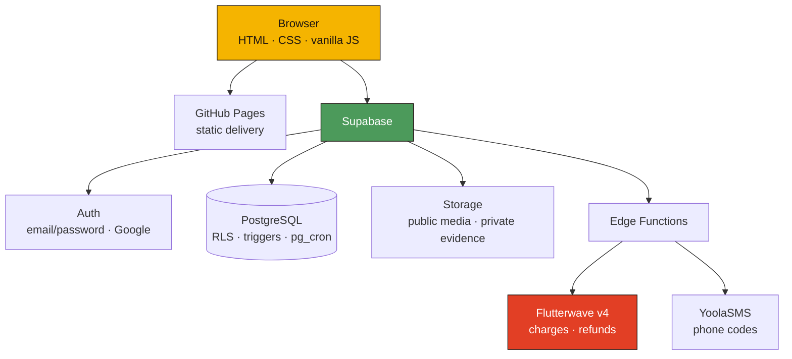

### Discover locally. Order simply. Pay safely.

A local-first marketplace for Kampala's neighbourhood stalls. Browse without an account,
pay first with MTN or Airtel Mobile Money, and have it delivered by the nearest verified rider.
Your money waits with Tonninyira until you say the order is right.

  
  
  
  
  

<a href="https://speakpower-commits.github.io/tonninyira/index.html"><strong>Open the live marketplace →</strong></a>

 

The businesses Tonninyira brings online — open-air produce traders in Kampala.

---

## What is Tonninyira?

Tonninyira puts real market stalls on the customer's phone. A customer orders from one or more
stalls, pays once by Mobile Money, and the nearest boda rider collects and delivers. Stalls sell
more, riders earn more, customers save a trip.

Three rules shape everything:

1. **Pay first, never cash on delivery.** No stall or rider starts work on an unpaid order.
2. **Money is held until the customer is happy.** Partners are paid only once the order is
   delivered and the customer has confirmed it or had 12 hours to complain.
3. **Talk to the rider and the stall first, support second.** Problems are usually fastest to fix
   directly; support steps in with photo proof when they are not.

Discovery is public; anything with money or private data sits behind an account (email + password
or Google). The app installs like a native app on Android and iPhone and runs in six languages:
English, Luganda, Kiswahili, Acholi, Lumasaba and Runyankole.

---

## What each person can do

| Customer | Stall (vendor) | Rider | Support (Command Center) |
| --- | --- | --- | --- |
| Browse stalls with real photos (up to 8 per product) and short videos; swipe a product's photos and **Add this one** when each photo is a different version with its own price | Manage logo, stall photos, 5-minute videos and products in **My stall**; give each product photo its own name, price and Sold out switch | See nearby paid deliveries and accept in one tap | Approve, suspend or remove partners (audited) |
| **Ask if it's available** before buying | Answer **Customers asking** with Yes / No, optionally marking it sold out | Home with earnings goal, best hours and busy areas (Tonninyira Assist) | **Cases**: complaints with photos, support-only notes, decisions |
| Pay with MTN or Airtel Mobile Money | Accept a paid order within **15 minutes**, ticking anything it doesn't have | Step-by-step active delivery with maps, call and WhatsApp | Decide the money on a complaint: release, partial or full refund |
| **Got it, all good** or **Report a problem** with photos | **Mark sold out / Back in stock** per product | **Issues** on deliveries, with replies and photos | **Refunds** panel: retry failed ones, mark manual ones paid |
| Call or WhatsApp the rider and stall on an active order | **Issues** raised on its orders, with replies and photos | Wallet: Available / On hold, payouts to the verified phone | Payments, settlements, payouts, orders, customers, audit log, CSV |
| Loyalty points for free delivery | Wallet: Available / On hold / Under review | | |

---

## How an order flows

```mermaid
flowchart LR
  A["Browse<br/>no account needed"] --> B["Basket<br/>one or more stalls"]
  B --> C{"Sign in"}
  C --> D["Pay first<br/>MTN / Airtel"]
  D --> E["Stall confirms<br/>within 15 min"]
  E --> F["Nearest rider<br/>collects and delivers"]
  F --> G{"Customer"}
  G -->|"Got it, all good<br/>or 12 h pass"| H["Stall's money released"]
  G -->|"Report a problem"| I["Held until support decides"]
  style D fill:#E23F25,stroke:#1C1410,color:#ffffff
  style H fill:#4C9A5B,stroke:#1C1410,color:#ffffff
  style I fill:#F5B400,stroke:#1C1410,color:#1C1410
```

- **No answer from the stall in 15 minutes** → that stall's part is cancelled and refunded automatically.
- **Stall doesn't have an item** → it ticks it when accepting; the customer is refunded for that item.
- **Stall declines** → the customer is refunded in full for that stall.
- **Sold-out products** can't be added to the basket, and the database refuses orders for them.

---

## How the money works

One payment, many recipients. The customer pays once for the whole basket; Tonninyira holds the
money and keeps a separate ledger line for every stall and for the rider.

```mermaid
flowchart TB
  P["Customer pays once<br/>items + one delivery fee"] --> T["Held by Tonninyira"]
  T --> S1["Stall A<br/>items − 5%"]
  T --> S2["Stall B<br/>items − 5%"]
  T --> R["Rider<br/>delivery fee − 5%"]
  T --> F["Tonninyira<br/>5% service fee"]
  style T fill:#F5B400,stroke:#1C1410,color:#1C1410
  style F fill:#E23F25,stroke:#1C1410,color:#ffffff
```

| Money | When it can be withdrawn |
| --- | --- |
| A stall's share | 12 hours after delivery, or straight away when the customer taps **Got it, all good**. Frozen while a complaint about that stall is open. |
| The rider's share | As soon as the whole order is delivered (one rider, one delivery fee per order). Frozen only for complaints about the rider or a missing delivery. |
| Refunds | Sent automatically to the customer's Mobile Money. A stall at fault also covers the delivery fee, so the rider is still paid. |

Partners see **Available to withdraw**, **On hold** and **Under review** separately, and can only
request money that is actually released. Mobile Money payouts go only to the phone verified on the
account.

---

## How a stall joins

Every vendor creates an account, submits an application with their trading credentials, and
waits for review. Nothing reaches the storefront unapproved.

```mermaid
flowchart LR
  A["Create account<br/>email + password"] --> B["Submit application<br/>KCCA · URA · UNBS"]
  B --> C["Status: pending"]
  C --> D{"Admin review"}
  D -->|"Approve"| E["Live on the storefront"]
  D -->|"Reject"| F["Not published"]
  style C fill:#F5B400,stroke:#1C1410,color:#1C1410
  style E fill:#4C9A5B,stroke:#1C1410,color:#ffffff
  style F fill:#9C897A,stroke:#1C1410,color:#ffffff
```

> [!IMPORTANT]
> **The rules live in the database, not the interface.** Row-level security, triggers and
> `SECURITY DEFINER` functions enforce pay-first, approval, who can see a complaint, balances,
> refunds and every admin action — so they hold even if someone calls the API directly.

---

## Architecture

```mermaid
flowchart TB
  B["Browser<br/>HTML · CSS · vanilla JS"] --> P["GitHub Pages<br/>static delivery"]
  B --> S["Supabase"]
  S --> AU["Auth<br/>email/password · Google"]
  S --> DB[("PostgreSQL<br/>RLS · triggers · pg_cron")]
  S --> ST["Storage<br/>public media · private evidence"]
  S --> EF["Edge Functions"]
  EF --> FW["Flutterwave v4<br/>charges · refunds"]
  EF --> SMS["YoolaSMS<br/>phone codes"]
  style B fill:#F5B400,stroke:#1C1410,color:#1C1410
  style S fill:#4C9A5B,stroke:#1C1410,color:#ffffff
  style FW fill:#E23F25,stroke:#1C1410,color:#ffffff
```

| Layer | Choice | Why |
| --- | --- | --- |
| Frontend | Vanilla JS, no build step | Fast on an ordinary Android phone and a thin connection. |
| Backend | Supabase | Auth, PostgreSQL, row-level security, storage, cron and serverless functions in one place. |
| Hosting | GitHub Pages | The live site deploys from the `tonninyira-enhancements` branch. |
| Payments | Flutterwave v4 | MTN and Airtel Mobile Money, plus refunds back to the same wallet. |

**Scheduled jobs (pg_cron)**

| Job | Every | Does |
| --- | --- | --- |
| `tn-expire-unpaid-orders` | 5 min | Cancels orders still unpaid after 30 minutes. |
| `tn-retry-unmatched-deliveries` | 1 min | Re-offers paid orders that no rider has taken. |
| `tn-expire-unconfirmed-paid-orders` | 1 min | Cancels and refunds a stall's part if it did not confirm within 15 minutes. |
| `tn-process-refunds` | 2 min | Wakes `process-refunds` when refunds are waiting. |

---

## Where things are

**Pages**

| File | What it is |
| --- | --- |
| `index.html` | Storefront, basket, checkout, orders and account (the main app). |
| `register.html` | Vendor and rider applications. |
| `vendor-dashboard.html` · `rider-dashboard.html` | Partner dashboards. |
| `admin-control-tower.html` | Command Center for Tonninyira staff. |
| `guide.html` · `terms.html` | How it works and the terms, in six languages. |

**Main scripts**

| File | Does |
| --- | --- |
| `flutterwave-payments-v2.js` | Mobile Money checkout popup (creates one order row per stall, starts the charge). |
| `order-help.js` | On each order: Got it / Report a problem, call or WhatsApp the rider and stall, complaint cases. |
| `case-thread.js` · `partner-cases.js` | Shared case conversation with photos; the Issues list for stalls and riders. |
| `product-questions.js` | "Ask if it's available" for customers and "Customers asking" for stalls. |
| `media-uploader.js` · `vendor-stall-media.js` · `stall-viewer.js` | Photo/video upload with on-phone compression, My stall, full-screen viewer. |
| `partner-wallet-payouts.js` · `partner-dashboard-auth-earnings.js` | Partner wallet (Available / On hold / Under review), payouts and earnings. |
| `rider-home.js` · `rider-nearby-dispatch.js` · `rider-inbox.js` | Rider home, nearby offers and alerts. |
| `guest-access-flow.js` · `account-session-ui.js` | Sign-in, sign-up and the account menu. |

**Database (Supabase, highlights)**

| Object | Purpose |
| --- | --- |
| `orders` | One row per stall per order; `order_id` groups a basket. The first stall's row carries the delivery fee. |
| `platform_settlements` · `settlement_ledger` · `my_partner_balance()` | What each stall and rider earned, and whether it is unpaid, held, under review, ready or settled. |
| `request_partner_payout()` | Payout requests, limited to released money. |
| `confirm_order_received()` | The customer's "Got it, all good". |
| `vendor_accept_order()` | A stall accepts, optionally marking items it doesn't have (refunded automatically). |
| `order_refunds` · `refund_cancelled_paid_order` | The refund queue, filled automatically on declines, timeouts, missing items and decisions. |
| `support_conversations` · `support_messages` · `admin_resolve_case_money()` | Complaint cases with photo evidence (private `support-evidence` bucket) and their money decisions. |
| `product_questions` · `answer_product_question()` | "Is it still available?" questions and answers. |
| `admin_actions` | Audit log of every Command Center action. |

**Edge Functions**

| Function | Does |
| --- | --- |
| `create-flutterwave-payment` · `verify-flutterwave-payment` · `flutterwave-webhook` | Start, verify and confirm Mobile Money payments (the webhook also tracks refunds). |
| `process-refunds` | Sends queued refunds to Flutterwave (one fixed idempotency key per refund, so it never pays twice). |
| `disburse-partner-payout` · `flutterwave-transfer-webhook` | Partner payouts to Mobile Money (needs Flutterwave Transfers). |
| `send-phone-otp` · `verify-phone-otp` | Phone verification by SMS. |

Sources for `process-refunds` and `flutterwave-webhook` are kept in
[`docs/edge-functions/`](docs/edge-functions) for reference.

---

## Configuration

Secrets live only in **Supabase → Edge Functions → Secrets**, never in this repository.
Names only:

| Secret | Used for |
| --- | --- |
| `FLW_CLIENT_ID` · `FLW_CLIENT_SECRET` | Flutterwave v4 API access (payments and refunds). |
| `FLW_SECRET_HASH` | Checking that webhooks really come from Flutterwave. |
| `FLW_ENV` | `live` switches every payment function from the sandbox to live money. Unset = sandbox. |
| `FLW_SECRET_KEY` · `FLW_TRANSFER_WEBHOOK_HASH` | Partner payouts through Flutterwave Transfers. |
| `YOOLASMS_API_KEY` | Sending phone verification codes. |
| `APP_RETURN_URL` | Optional: where customers land after paying (defaults to the live site). |

The refund worker's own token is generated inside the database (`tn_internal_config`) and never
leaves Supabase.

---

## Going live checklist

1. Register the business; open the business bank account.
2. In Flutterwave: complete business verification and get **live v4** keys; enable **Transfers** for payouts.
3. In Supabase secrets: set the live `FLW_CLIENT_ID`, `FLW_CLIENT_SECRET`, `FLW_SECRET_HASH` (and the Transfers keys).
4. In Flutterwave: point the webhook to `…/functions/v1/flutterwave-webhook`.
5. Set `FLW_ENV=live`.
6. Place one small real order, refund it from a complaint, and confirm the money comes back.

---

## Project status

| Area | State |
| --- | --- |
| Storefront, accounts (email/password, Google), six languages, installable app | ✅ Live |
| Vendor / rider applications, approval and Command Center | ✅ Live |
| Photos and 5-minute videos ("buy what you see") | ✅ Live |
| A price per photo (product options), charged by the database | ✅ Live |
| Pay-first Mobile Money checkout | ✅ Live in the Flutterwave **sandbox** |
| Nearby rider dispatch | ✅ Live |
| Hold-until-happy wallet, 15-minute stall confirmation, sold out, Ask the stall | ✅ Live |
| Complaint cases with photo proof and money decisions | ✅ Live |
| Automatic refunds | ✅ Verified end to end in the Flutterwave sandbox |
| Automatic partner payouts | ⏳ Built; needs Flutterwave Transfers on the live account |

**Known gaps**
- Notifications are recorded (`notifications`) but there is no in-app inbox for customers or stalls yet; key events also show on the order card and dashboards.
- On 360 px phones the "Account ▾" chip on the partner dashboards makes the header slightly wider than the screen.
- One rider carries a multi-stall basket; one rider collecting from far-apart stalls is not yet optimised.

---

## Roadmap

**Near term**
- Go live on Flutterwave (checklist above) and turn on automatic payouts
- In-app notification inbox for customers, stalls and riders
- Customer order tracking through each fulfilment stage

**Next**
- Map-based location and road-aware delivery fees
- Partner performance dashboards (response time, complaints, sold-out accuracy)
- Repeat-purchase recommendations

**Longer term**
- Demand heatmaps and delivery-zone planning from real order geography
- Unit economics per stall and per neighbourhood

---

## Documentation

- **[docs/ARCHITECTURE.md](docs/ARCHITECTURE.md)** — data model, authentication and authorization,
  analytics event model, security notes, repository layout and local development.
- **[docs/edge-functions/](docs/edge-functions)** — source of the refund worker and payment webhook.
- **[Live site](https://speakpower-commits.github.io/tonninyira/index.html)** — the running marketplace.

---

**Built for local commerce. Designed to scale with evidence.**

Tonninyira · Kampala, Uganda

