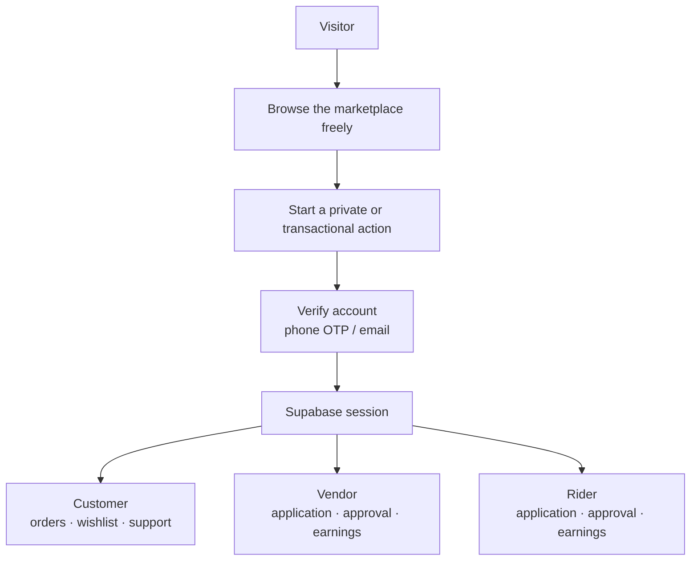
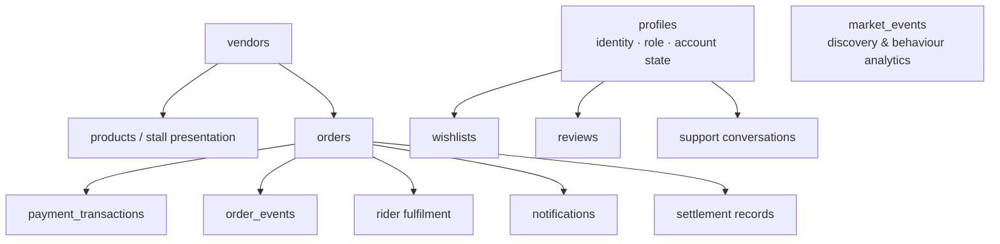
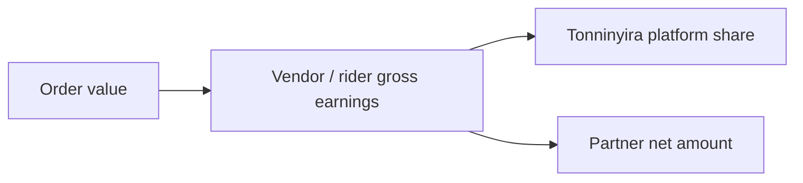
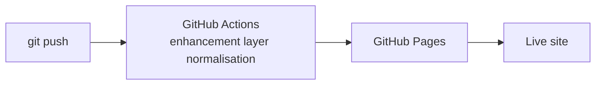

# Tonninyira — Architecture & Reference

The detail behind the [README](../README.md): how identity, data, money and analytics are
actually put together.

---

## Product principles

**01 — Browse before you sign in.** Marketplace discovery is public. People can see stalls,
products, prices, images and delivery information before creating an account.

**02 — One identity across the journey.** Once a customer verifies with Supabase Auth, that
same authenticated session is reused for account access, Support, Orders, Wishlist and payment
flows.

**03 — Low-friction mobile UX.** The interface is touch-first and designed to remain useful on
ordinary Android devices and constrained connections.

**04 — Transparent marketplace economics.** Vendor and rider earnings are represented as gross
earnings, Tonninyira's platform share and the partner's net amount. The current operating model
uses a 5% platform cut for partner settlement.

**05 — Data becomes product intelligence.** Every meaningful marketplace event can become a
useful signal: search behaviour, product discovery, orders, cancellations, payment state,
repeat purchasing, fulfilment speed, geography and partner productivity.

---

## Core capabilities

### Customer
Public marketplace browsing · Eats / Shop category split · vendor and stall discovery · product
search · area entry and device location · basket and multi-vendor order grouping · account
creation and sign-in with phone OTP or email · order history and status · reviews and ratings ·
private Support · account-backed wishlist that persists across sessions.

### Vendor
Account verification · application and approval workflow · stall registration · product and menu
presentation · incoming order workflow · gross earnings, platform deduction and net earnings ·
settlement history · Mobile Money / bank payout requests.

### Rider
Account verification · application and approval workflow · delivery job workflow · delivery
completion · gross earnings, platform deduction and net earnings · settlement history · Mobile
Money / bank payout requests.

### Payments
The payment architecture targets Flutterwave and mobile-money checkout. Payment state is
recorded separately from the order lifecycle so a payment attempt can be traced without
corrupting the core order record.

Actual money movement depends on configured provider credentials. Secrets live in Supabase Edge
Function configuration, never in this repository.

### Delivery and location
Customer location is captured from a combination of typed area information and browser/device
coordinates. The fee engine uses distance-based tiers computed with the Haversine formula
against each vendor's registered coordinates; full road-route optimisation can be added later as
a mapping layer.

---

## Authentication & authorization

Supabase Auth is the source of truth for verified identity.



The important distinction is between **saved customer details** and a **real authenticated
session**. A name or phone number held in browser storage is convenience data, never proof of
authentication.

Private customer data is protected with row-level security policies tied to the authenticated
user.

### Partner onboarding policies

An applicant may create their own partner record, and only in a pending state:

```sql
create policy vendors_self_apply on public.vendors
  for insert to authenticated
  with check (auth_user_id = auth.uid() and approval_status = 'pending');
```

The same shape applies to `riders`. `approval_status` defaults to `'pending'`, and the
`vendors_public` / `riders_public` views serve approved rows only — so approval is a real
control, not a label. Staff and admin policies for reading, updating and approving remain
separate.

---

## Data model

The marketplace is designed around operational entities rather than one large order table.



Live tables include `profiles`, `vendors`, `riders`, `orders`, `wishlists`, `reviews`,
`support_conversations`, `support_messages`, `role_requests`, `partner_payouts`,
`platform_settlements`, `loyalty_accounts`, `loyalty_transactions`, `market_events`,
`order_events`, `notifications`, `payment_transactions`, `rider_locations`, `delivery_offers`,
`rider_delivery_alerts`, `admin_users` and `admin_guides`, plus the `vendors_public`,
`riders_public` and `my_settlement_summary` views.

---

## Wishlist model

Wishlist is account-based, not browser-based. A customer taps the heart on a stall, signs in
once when asked, and the stall is saved to `public.wishlists`. **My wishlist** opens from the
Account panel; items can be removed at any time and reappear on the same account later.

The table is protected by owner-only RLS policies, so one customer cannot read or modify
another customer's wishlist.

---

## Marketplace economics



Settlement currently uses a **5% platform cut**. Payout requests are represented in the wallet
workflow; the external provider performs the final transfer of funds.

---

## Analytics direction

The event model exists so product decisions can eventually be driven from marketplace evidence
rather than intuition.

| Question | Useful signal |
| --- | --- |
| Where is demand growing? | Area + search + order geography |
| Which stalls convert best? | Discovery → stall view → basket → order |
| Which products drive repeat business? | Product orders + repeat-customer behaviour |
| Where does fulfilment slow down? | Order and rider event timestamps |
| Are partners economically viable? | Gross → platform cut → net → payout data |
| Why do customers leave? | Abandoned baskets, cancellations, payment failures |
| Which customers return? | Authenticated order history + cohort behaviour |

> [!NOTE]
> `market_events`, `order_events` and `notifications` exist and are protected by RLS, but no
> client code writes to them yet. Until that instrumentation is added, these questions are not
> answerable from live data.

This is the foundation for demand forecasting, stall recommendations, delivery-zone planning,
partner productivity analysis and unit-economics modelling.

---

## Repository structure

```text
tonninyira/
├── index.html                       # Main marketplace experience
├── register.html                    # Vendor / rider application (account-gated)
├── auth-callback.html               # Email sign-in return surface
├── guest-access-flow.js             # Public browsing + account-gated actions + role choice
├── session-compat.js                # Shared Supabase client/session bridge
├── account-session-ui.js            # Account state + sign-out UI
├── support-session-fix.js           # Support session reliability guard
├── wishlist-account.js              # Authenticated wishlist UI
├── enhancements.js                  # Product enhancement layer
├── performance-optimizations.js     # Gallery and loading performance
├── flutterwave-payments-v2.js       # Payment initiation client
├── payment-return*.html             # Payment return surfaces
├── vendor-dashboard.html            # Vendor operations
├── rider-dashboard.html             # Rider operations
├── rider-nearby-dispatch.js         # Automatic nearby rider dispatch
├── rider-realtime-alerts.js         # Supabase Realtime rider alerts
├── partner-dashboard-auth-earnings.js
├── partner-wallet-payouts.js        # Payout request workflow
├── admin.html                       # Admin partner registration console
├── admin-control-tower.html         # Admin command centre + approval queue
├── admin-session-fix.js             # Admin session/authorization guard
├── assets/
│   ├── tonninyira-mark.svg
│   └── market/                      # Market photography + optimised WebP
├── docs/ARCHITECTURE.md             # This file
└── README.md
```

> The repository contains both the original application and a deliberately layered enhancement
> system. Some superseded files remain in the branch for reference even when their scripts are
> no longer injected into the live page.

---

## Local development

Tonninyira is a static web application, so the fastest local setup is a simple HTTP server.

```bash
git clone https://github.com/SpeakPower-commits/tonninyira.git
cd tonninyira
python -m http.server 8000
```

Then open `http://localhost:8000`.

Authentication, database access and payment flows depend on external services, so local testing
still needs the Supabase project configured and the local origin added to the Supabase Auth
redirect allowlist.

---

## Deployment



The site is served by **GitHub Pages** from the `tonninyira-enhancements` branch at
`speakpower-commits.github.io/tonninyira`. GitHub Actions normalises the enhancement loading
layer on push; commits carrying `[skip enhancement injector]` bypass that step.

---

## Security notes

- Never commit Supabase service-role keys.
- Never commit Flutterwave secret keys or webhook hashes.
- Keep payment secrets in Supabase Edge Function secrets.
- Treat browser-stored customer details as convenience data, not authentication.
- Keep private customer tables behind RLS.
- Escape every value written into `innerHTML`. Vendor-supplied fields — business name, logo URL,
  gallery URLs and captions — reach every shopper's browser; unescaped, they execute.
- Restrict URL schemes on any vendor-supplied `src` to `http`/`https`; `javascript:` and
  `data:text/html` execute even when quoting is correct.
- Validate server-side payment state before treating an order as paid.
- Do not trust client-supplied platform fees or settlement totals without server-side controls.
